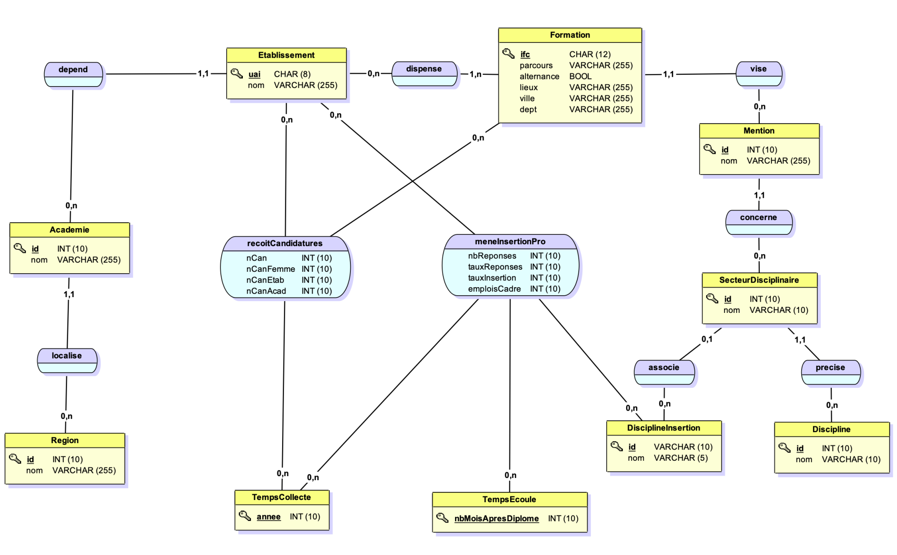
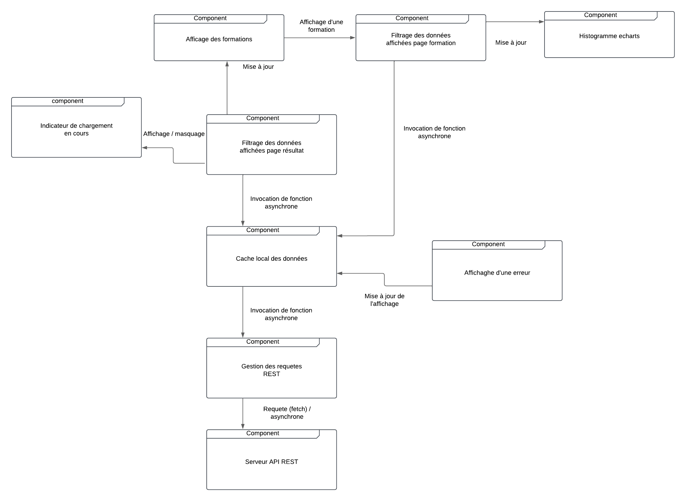

# Document administrateur

## Présentation technique

### Architecture du projet
Le projet repose sur une architecture composée des technologies :
- HTML pour la structure des pages web.
- PHP pour la gestion des fonctionnalités dynamiques côté serveur.
- SCSS pour une gestion avancée des styles et une meilleure organisation des feuilles de styles.
- JavaScript (JS) pour les interactions front-end et les fonctionnalités dynamiques côté client.

De plus, une API externe est utilisée pour récupérer et afficher les informations liées aux différents masters.

Le site sera hébergé sur le serveur de l’université

## Guide de déploiement
Ce guide est conçu pour un ordinateur personnel fonctionnant sous Windows.

### Prérequis
1. **Node.js** doit être installé sur l’ordinateur pour permettre l’installation des packages nécessaires
2. **GIT** doit être installé sur l’ordinateur pour avoir accès aux commandes associés (penser à redémarrer après l’installation)
3. **VSCode** pour éditer le code
4. **PHP** doit être installé pour lancer le serveur local

### Installation
1. Ouvrir **VS Code**.
2. Dans l’explorateur de fichier, choisir *Clone Repository*
3. Puis choisir *Cloner à partir de GitHub*
4. Autoriser le popup de connexion dans **VS Code** (uniquement si pas connecté à GitHub)
5. Se connecter à **GitHub** (uniquement si vous avez effectué l’étape précédente.)
6. Choisir le dépot git *GGLabFR/SAE301303DWeb2*
7. Sélectionner le dossier dans lequel cloner le projet
8. Ouvrir le projet avec **VS Code**
9. Installer toutes les dépendances en exécutant, dans le terminal, la commande :  
   *npm install* 

### Lancement de l’application
Lancer un serveur local PHP pour tester le site en local. 

Téléversement sur le serveur via FileZilla

Une fois le projet finalisé et testé en local, voilà les étapes pour téléverser les fichiers sur le serveur de l’université :
1. **Ouvrez FileZilla** et connectez-vous au serveur :
    * **Hôte** : transit.univ-lemans.fr
    * **Nom d'utilisateur** : Entrez votre identifiant fourni par l’université.
    * **Mot de passe** : Entrez votre mot de passe associé.
    * **Port** : 22
2. Une fois connecté, dans le **panneau de gauche**, naviguez vers le répertoire local contenant les fichiers du projet.
3. Dans le **panneau de droite**, accédez au répertoire distant
4. Sélectionnez tous les fichiers et dossiers de votre projet dans le panneau de gauche et glissez-les vers le panneau de droite pour les téléverser.
5. Une fois le téléversement terminé, vérifiez que le site est accessible en ligne en visitant l'URL
## Modèle de données

## Diagramme de composants

## Roadmap prévisionnelle
### Semaine 46 - 51 : Développement
- Développement du front-end (HTML, PHP, SCSS, JS).
- Intégration de l’API externe pour les informations sur les masters.
- Ajout des graphiques et indicateurs visuels.
### Semaine 50 - 51 : Tests et corrections
- Tests unitaires et d’intégration.
- Identification et correction des bugs.
### Semaine 51 : Déploiement
- Mise en ligne de l’application via FileZilla.
- Tests finaux en production pour garantir la qualité du site.
### Bugs tracking
Nous utilisons le système de bug tracking de GitHub pour suivre les problèmes rencontrés lors du développement.
Lorsqu'une nouvelle issue est créée, il apparait dans le tableau de bug tracking. Cela nous permet de mieux organiser la traque de bugs.
Lien du bug tracking : https://github.com/users/GGLabFR/projects/1/views/1

## Annexe
### Ressources 
Lien vers le dépot Github : https://github.com/GGLabFR/SAE301303DWeb2

Lien vers la documentation API : https://umtice.univ-lemans.fr/pluginfile.php/625048/mod_resource/content/1/ModeleDonneesEtAPI.pdf 
### Contacts
- Maël Roulette : mael.roulette.etu@univ-lemans.fr
- Floriane Louis : floriane.louis.etu@univ-lemans.fr
- Lucie Cristol : lucie.cristol.etu@univ-lemans.fr 
- Gwendal Guilloux : gwendal.guilloux.etu@univ-lemans.fr
- Lucas Chesneau : lucas.chesneau.etu@univ-lemans.fr
